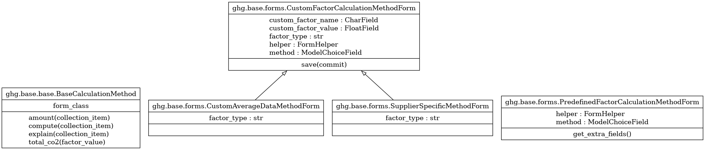

Common
======

Generic calculation implementations
-----------------------------------

.. autoclass:: greenlang.calculations.ghg.base.base.BaseCalculationMethod
    :members:

Generic forms
-------------

.. autoclass:: greenlang.calculations.ghg.base.forms.PredefinedFactorCalculationMethodForm()
    :members:

.. autoclass:: greenlang.calculations.ghg.base.forms.CustomFactorCalculationMethodForm()
    :members:

.. autoclass:: greenlang.calculations.ghg.base.forms.SupplierSpecificMethodForm()
    :members:

.. autoclass:: greenlang.calculations.ghg.base.forms.CustomAverageDataMethodForm()
    :members: