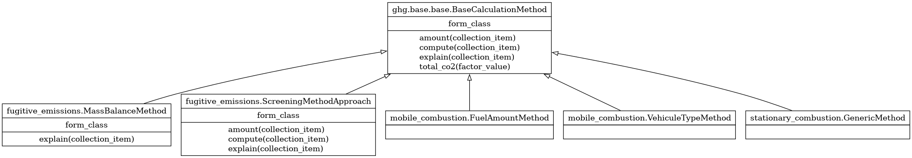
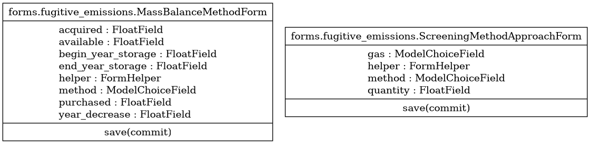

Scope 1
*******

Calculation method implementations
----------------------------------

Category 1: Stationary Combustion
^^^^^^^^^^^^^^^^^^^^^^^^^^^^^^^^^

.. autoclass:: greenlang.calculations.ghg.scope_1.stationary_combustion.GenericMethod
    :members:

Category 2: Mobile Combustion
^^^^^^^^^^^^^^^^^^^^^^^^^^^^^

.. autoclass:: greenlang.calculations.ghg.scope_1.mobile_combustion.FuelAmountMethod
    :members:

.. autoclass:: greenlang.calculations.ghg.scope_1.mobile_combustion.VehicleTypeMethod
    :members:

Category 3: Fugitive Emissions
^^^^^^^^^^^^^^^^^^^^^^^^^^^^^^

.. autoclass:: greenlang.calculations.ghg.scope_1.fugitive_emissions.MassBalanceMethod
    :members:

.. autoclass:: greenlang.calculations.ghg.scope_1.fugitive_emissions.ScreeningMethodApproach
    :members:

Forms
-----

Category 3: Fugitive Emissions
^^^^^^^^^^^^^^^^^^^^^^^^^^^^^^

.. autoclass:: greenlang.calculations.ghg.scope_1.forms.fugitive_emissions.MassBalanceMethodForm()
    :members:

.. autoclass:: greenlang.calculations.ghg.scope_1.forms.fugitive_emissions.ScreeningMethodApproachForm()
    :members: