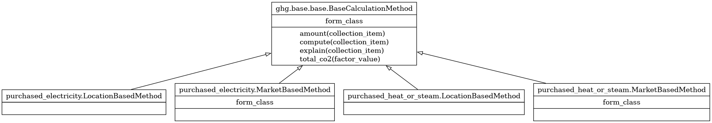
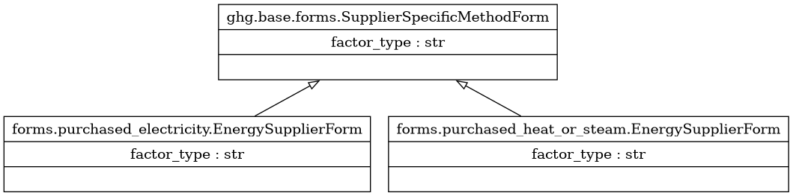

Scope 2
*******

Calculation implementations
----------------------------

Category 1: Purchased Electricity
^^^^^^^^^^^^^^^^^^^^^^^^^^^^^^^^^

.. autoclass:: greenlang.calculations.ghg.scope_2.purchased_electricity.LocationBasedMethod
    :members:

.. autoclass:: greenlang.calculations.ghg.scope_2.purchased_electricity.MarketBasedMethod
    :members:

Category 2: Purchased Heat or Steam
^^^^^^^^^^^^^^^^^^^^^^^^^^^^^^^^^^^

.. autoclass:: greenlang.calculations.ghg.scope_2.purchased_heat_or_steam.LocationBasedMethod
    :members:

.. autoclass:: greenlang.calculations.ghg.scope_2.purchased_heat_or_steam.MarketBasedMethod
    :members:

Forms
-----

Category 1: Purchased Electricity
^^^^^^^^^^^^^^^^^^^^^^^^^^^^^^^^^

.. autoclass:: greenlang.calculations.ghg.scope_2.forms.purchased_electricity.EnergySupplierForm()
    :members:

Category 2: Purchased Heat or Steam
^^^^^^^^^^^^^^^^^^^^^^^^^^^^^^^^^^^

.. autoclass:: greenlang.calculations.ghg.scope_2.forms.purchased_heat_or_steam.EnergySupplierForm()
    :members:

